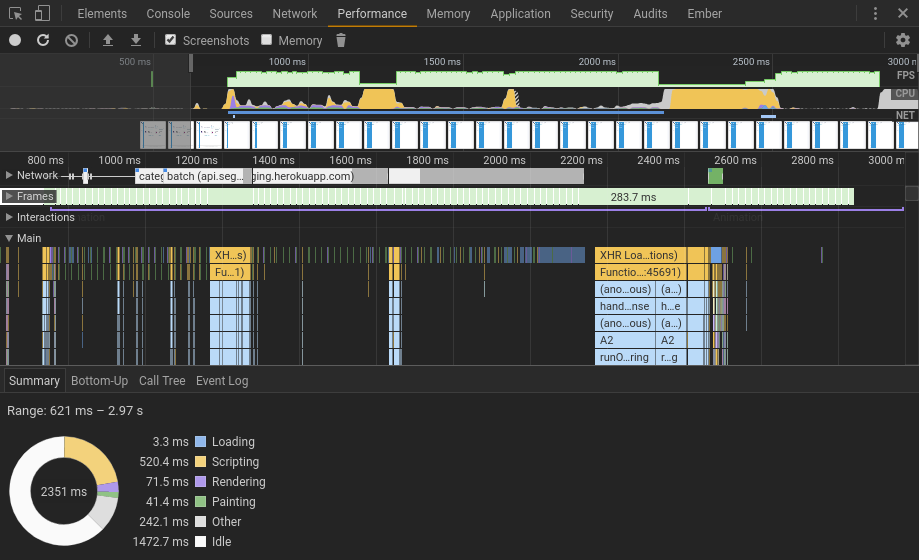

# Performance

I've implemented the same feature within one of our application using
[tomjkidd/elm-multiway-tree-zipper](http://package.elm-lang.org/packages/tomjkidd/elm-multiway-tree-zipper/latest)
and this package and profiled performance with real production data.

Application fetch data from two endpoints and then builds a Tree from them. The total number of nodes within resulting three is 4278.

# Strict Implementation (tomjkidd/elm-multiway-tree-zipper)

MacOS Chrome:


Arch Linux Chromium:


# HW specifications

MacOS Chrome:


Arch Linux Chromium:


## Conclusion

For large trees where it's not necessary to evaluate whole structure at once lazy tree is definitelly much more performant.
However if you're working with much smaller data strict version like `tomjkidd/elm-multiway-tree-zipper` should be fine.

## MacOS Chrome

```
MacBook Pro (Retina, 15-inch, Mid 2015)
2,2 GHz Intel Core i7
16 GB 1600 MHz DDR3
Intel Iris Pro 1536 MB
```

```
Chrome Version 63.0.3239.108 (Official Build) (64-bit)
```


## Arch Linux Chromium

```
OS: Arch Linux
Kernel: x86_64 Linux 4.14.9-1-ARCH
Packages: 1448
Shell: zsh 5.4.2
Resolution: 1920x1200
WM: XMonad
CPU: AMD Ryzen 7 1800X Eight-Core @ 16x 3.6GHz [41.0°C]
GPU: AMD/ATI Lexa PRO [Radeon RX 550]
RAM: 2985MiB / 32183MiB
```

```
Chromium Version 63.0.3239.108 (Developer Build) (64-bit)
```
